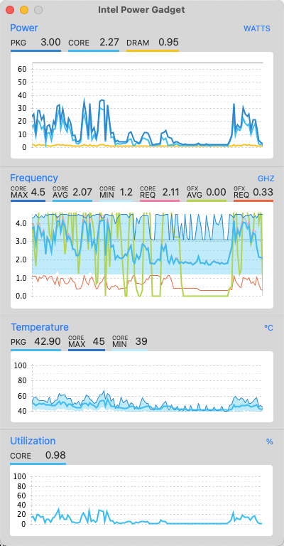
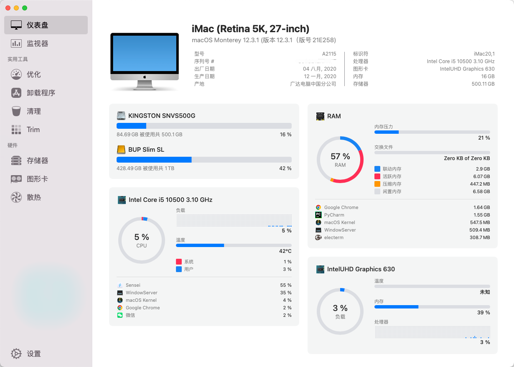
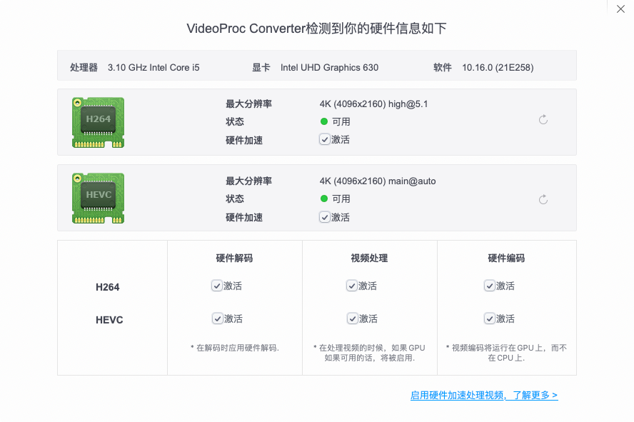

# Hackintosh_CVN-B460i
七彩虹CVN-B460i的EFI分享

## 更新日志
* 2022/04/28 OpenCore更新到0.8.0，更新了部分kext，Monterey支持12.3.1，发布了Original的RELEASE版本

## 使用
* 基于OpenCore 0.8.0  
* 支持MacOS Monterey 12.3.1  
* 基本配置清单  

| 配置  | 型号             |
|-----|----------------|
| 主板  | 七彩虹B460i       |
| CPU | i5-10500       |
| 硬盘  | 金士顿nv1 500G    |
| 内存  | 海力士 3200HZ 16G |
| 网卡  | Intel AX200    |

* 食用前修改config.plist中的三码，安装完成后可再次进行微调三码  

## BIOS设置
1. Fast Boot: 快速启动
   - B460I 没有此项
2. Secure Boot: 安全启动
   - Advanced -> Boot -> Secure Boot
3. Serial/COM Port: 串行端口
   - B460I 没有此项
4. Parallel Port: 并行端口
   - B460I 没有此项
5. VT-d: 虚拟化设置(Intel Virtual Technology)
   > 不影响安装，有虚拟化的需求的要打开
   - Advanced -> Advanced -> CPU Configuration -> Intel(VMX) Virtualization Technology
6. CSM: 兼容性支持模块(Compatibility Support Module)
   - Advanced -> Advanced -> CSM Configuration -> Disabled
7. Thunderbolt: 雷电口
   - B460I 没有此项
8. Intel SGX: Intel 安全容器技术
   - B460I 没有此项
9. Intel Platform Trust: PTT
   > 如果需要安装 Windows11 系统需要开启
10. CFG Lock: CFG 锁
    - OC -> CFG Lock -> Disabled

**OC 推荐开启的选项**
1. VT-x: CPU的硬件虚拟化技术的一种指令集
   - B460I 没有此项
2. Above 4G decoding: 
   - B460I 没有此项
3. DVMT: 动态显存分配技术
   - Advanced -> Advanced -> PCH Configuration -> Primary Display: IGFX
   - Advanced -> Advanced -> PCH Configuration -> Internal Graphic: Enabled
   - Advanced -> Advanced -> PCH Configuration -> IGFX Memory Size: 128M(或以上)
   - Advanced -> Advanced -> PCH Configuration -> DVMT Total Gfx Mem: 128M(或以上)
4. XMP: 内存超频功能
   - OC -> Memory Configuration -> Memory Profile: XMP Profile1
5. XHCI Hand-off:
   - Advanced -> Advanced -> USB Configuration -> XHCI Hand-off: Enabled
6. SATA Mode: AHCI
   - Advanced -> Advanced -> SATA Configuration -> SATA Mode Selection: AHCI

## 附图
* 关于本机  
  

* CPU睿频  

* Sensei信息截图  

* VideoProc核显硬件加速正常  

## 感谢
[AlphaGHX](https://github.com/AlphaGHX/Hackintosh-CVN-b460i-efi) 的EFI分享